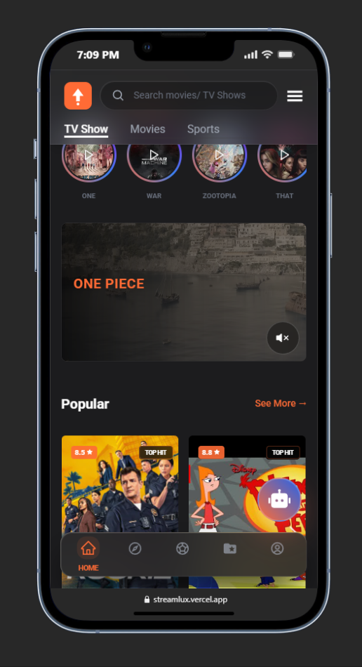
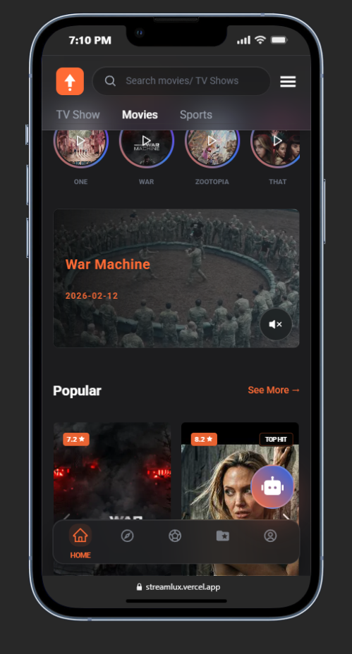
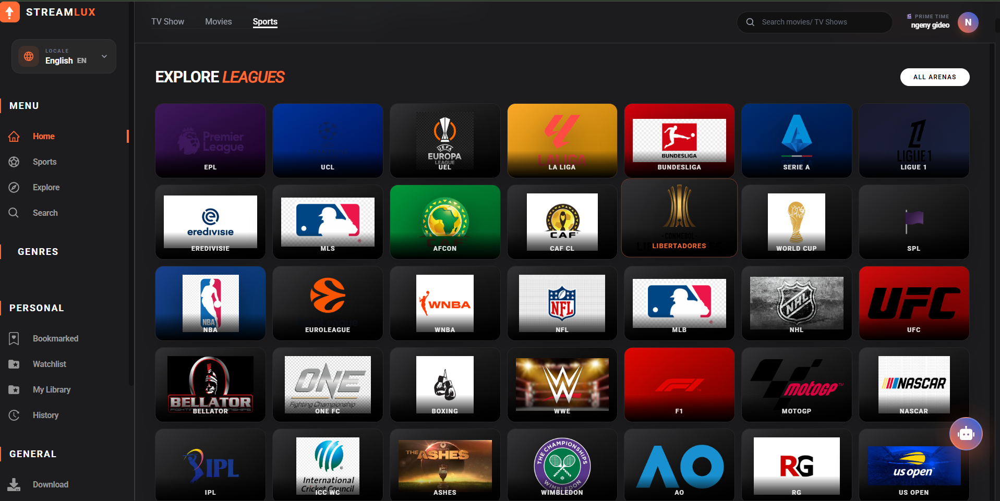
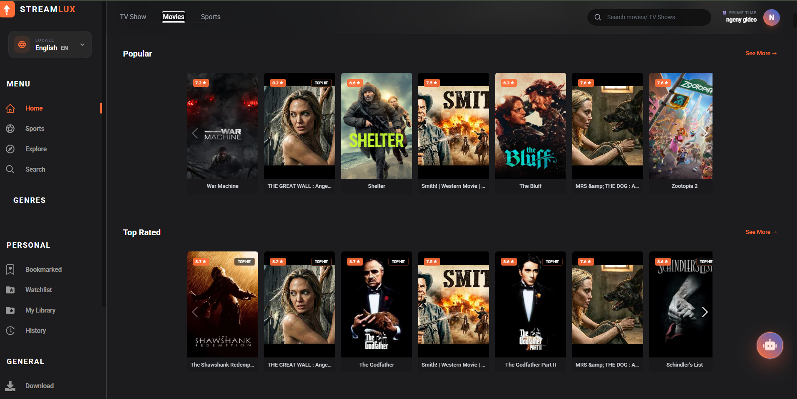
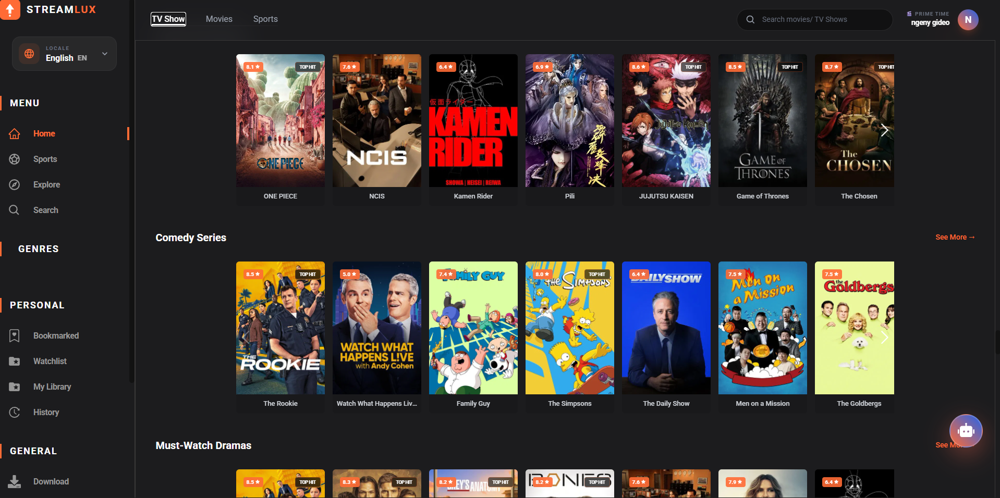

#  StreamLux

### **Free Movies, TV Shows & Live Sports Streaming Platform**

[](https://reactjs.org/)
[](https://www.typescriptlang.org/)
[](https://tailwindcss.com/)
[](https://firebase.google.com/)
[](https://redux-toolkit.js.org/)

---

## 🚀 Experience Excellence
**StreamLux** is a world-class, all-in-one streaming destination designed for the modern cinephile and sports enthusiast. Built with a focus on **stability, speed, and stunning UI**, it aggregates the best content from across the globe into a single, seamless experience.

🌐 **Live Demo:** [streamlux-67a84.web.app](https://streamlux-67a84.web.app)
⚙️ **Backend API:** [streamlux.onrender.com](https://streamlux.onrender.com)
📱 **Android App:** [Download Latest APK](https://github.com.streamlux.app/releases/latest/download/app-release-unsigned.apk)

---

## 🔥 Elite Sports Hub
Our newly engineered **Elite Sports Aggregator** brings you closer to the action than ever before.
- 🏆 **Unified Dashboard:** Real-time scores and live streaming from EPL, NBA, La Liga, and more.
- 🛠️ **Persistence Guard:** Advanced caching ensures your game data stays visible even during API hiccups.
- ⚡ **Multi-Source Engine:** Scrapes live matches from premium sources (VIP, WeScore, FoxTrend) for fallback reliability.
- 📺 **Immersive Match Details:** Deep-dive into lineups, stats, and fan predictions.

---

## 🎬 Cinematic Excellence
- **AI-Powered Discovery:** Smart recommendations that learn from your viewing patterns.
- **Global Reach:** Dedicated sections for African Cinema (Nollywood, SA Drama), Asian Hits (Anime, C-Drama), and Latin Gems.
- **High-Fidelity Streaming:** Multiple high-quality embed sources for every title.
- **Offline Ready:** One-click downloads for your journey, identical to the MovieBox experience.

---

## 📱 World-Class Mobile Experience
StreamLux is now a native powerhouse, offering a fluid and immersive mobile experience.

<p align="center">
  
  
</p>

- **Fluid Navigation:** Transition animations that feel premium and responsive.
- **Lightweight:** Only 50MB with a full native feature set.
- **Secure:** Integrated Firebase Auth with Google and Facebook support.

---

## 🖼️ Web Interface Preview

### Unified Sports Hub

*Modern dark mode with atmospheric glows and intuitive navigation for all major leagues.*

### Cinematic Movies Grid

*High-fidelity posters and real-time metadata for a premium browsing experience.*

### Immersive TV Discovery

*Personalized discovery across thousands of global titles.*

---

## 🛠️ Tech Stack & Architecture

- **Core:** React 18, TypeScript, TailwindCSS
- **State & Data:** Redux Toolkit, TanStack Query (React Query), Axios
- **Backend:** Firebase (Auth, Firestore), Node.js (Render.com)
- **Aggregators:** Custom multi-source scraping engine for Sports and Movies
- **Optimization:** LRU Caching, Rate Limiting, Request Batching

---

## 🚀 Getting Started

1. **Clone & Install:**
   ```bash
   git clone https://github.com.streamlux.app.git
   cd STREAMLUX
   npm install
   ```

2. **Environment Setup:**
   Create a `.env` file in the root:
   ```env
   REACT_APP_API_KEY = YOUR_TMDB_API_KEY
   ```

3. **Run Development:**
   ```bash
   npm start
   ```

---

## ⚖️ Legal
StreamLux is a technological aggregator. We do not host any content on our servers. Please refer to our [Privacy Policy](/privacy-policy) and [Copyright Page](/copyright) for full legal disclosure.

---

<p align="center">
  <b>If you like this project, give it a star ✨ and help us build the future of streaming.</b>
</p>
